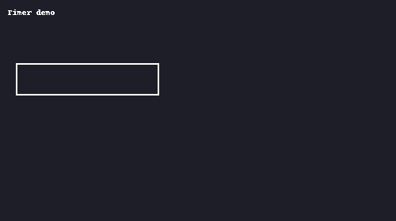
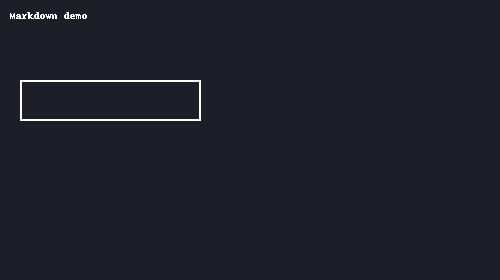
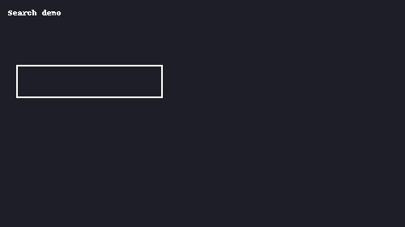

<!-- Banner (put a wide image at /assets/banner.png or swap URL) -->
<p align="center">
  
</p>

<h1 align="center">🚀 JS Mastery — Build • Ship • Learn</h1>

<p align="center">
  <b>Make real projects. Level up your thinking. One focused session at a time.</b>
</p>

<p align="center">
  <a href="https://developer.mozilla.org/en-US/docs/Web/JavaScript">JS</a> ·
  <a href="https://vitejs.dev/">Vite</a> ·
  <a href="https://eslint.org/">ESLint</a> ·
  <a href="https://vitest.dev/">Vitest/Jest</a> ·
  <a href="https://react.dev/">React</a> ·
  <a href="https://nodejs.org/">Node</a> ·
  <a href="https://www.typescriptlang.org/">TypeScript</a>
</p>

<p align="center">
  
  
  
  
</p>

---

> **Why this repo exists:** I get bored if progress isn’t visible. This roadmap manufactures momentum: tiny finishes every session, projects that grow, and habits that stick.

## 🔥 Today’s Hit (open, do, win)
- **Pick one:** `p01-timer` • `p02-markdown` • `p03-search`
- Start a **25/5**: hit one **DONE WHEN** checkbox below.
- Log a 15-sec GIF in the project README. Feel the win. Repeat.

---

## 🗂 Repo Map

```
js-mastery/
  w01-fundamentals/         # language katas + Timebox app
  w02-dom/                  # Todo-Plus (DOM/events/a11y)
  w03-async/                # API Dashboard (fetch/abort/retry)
  w04-tooling/              # Vite + ESLint/Prettier + scripts
  w05-testing/              # Vitest/Jest + Playwright + CI
  w06-node-api/             # Express/Fastify + JWT + Zod
  w07-db-cache/             # Postgres/Prisma + Redis + k6
  w08-react/                # Notes Web (React)
  w09-react-data/           # React Query/SWR + perf
  w10-typescript/           # TS migration + hardening
  capstone-notes-plus/      # Full-stack final
  Patterns.md               # thinking/playbook (living doc)
  assets/                   # banner + GIFs/screens
```

---

## 🧠 Session Recipe (paste this in your file/PR EVERY time)

```
SPEC: input/output + constraints (1–3 lines)
PLAN: 3–5 bullets max
TEST: one quick case I can run now
DONE WHEN: □ visible UI OR □ passing test OR □ route works
```

> You get bored when “done” is vague. Kill vagueness first.

---

## 🪜 Micro-Projects Ladder (60–120 min each)

- [ ] **p01 Timer** — start/pause/reset + localStorage
- [ ] **p02 Markdown** — textarea → preview, sanitize + debounce
- [ ] **p03 Image Gallery** — keyboard nav + preload
- [ ] **p04 CSV Viewer** — drag-drop CSV → table + filter
- [ ] **p05 Debounced Search** — public API + AbortController + error UI
- [ ] **p06 Kanban** — drag/drop + persist + reorder test
- [ ] **p07 Expense Tracker** — CRUD + chart + totals
- [ ] **p08 Notes API** — Node/Express + JWT + Zod + supertest
- [ ] **p09 Notes Web** — React (or vanilla + state machine) + optimistic updates
- [ ] **p10 Uploads** — file preview + size/type validation
- [ ] **p11 Cache** — Redis for `GET /notes/:id`
- [ ] **p12 E2E + Docker** — Playwright + docker-compose

> Bored? Ship the current rung, move to the next. **Momentum > perfection.**

---

## 📅 10-Week Roadmap (short + aggressive)

**W1 – Language Core**: types, scope, closures, `this`, prototypes/classes  
**Ship:** 20 katas + **Timebox** app  

**W2 – DOM/Events**: selectors, delegation, forms, a11y basics  
**Ship:** **Todo-Plus** (+ keyboard nav + labels)  

**W3 – Async**: promises/async-await, fetch, AbortController, retry/backoff, event loop  
**Ship:** **API Dashboard** (+ cancel + friendly errors)  

**W4 – Tooling**: Vite, npm scripts, ESLint/Prettier, env, ESM/CJS  
**Ship:** Convert projects + pre-commit lint + Lighthouse note  

**W5 – Testing**: Vitest/Jest (+jsdom), Playwright E2E, coverage + CI  
**Ship:** 80% coverage core logic + 1 E2E flow + CI green  

**W6 – Node API**: Express/Fastify, JWT, Zod, error handling, logging  
**Ship:** **Notes API** + Dockerfile + supertest  

**W7 – DB & Cache**: Postgres/Prisma, cursor pagination, Redis, k6  
**Ship:** cached `GET /notes/:id`, **p95 < 150ms** locally  

**W8 – React**: controlled forms, effects, error boundaries, composition  
**Ship:** **Notes Web** client  

**W9 – React Data**: React Query/SWR, invalidation, infinite scroll, perf  
**Ship:** “Feels fast” UX (measured)  

**W10 – TypeScript + Hardening**: strict mode, shared types, Helmet/CORS/rate-limit  
**Ship:** TS migration + security pass + final README + demo GIFs

---

## ✅ Progress & Streak

**Weekly milestones**
- [ ] W1
- [ ] W2
- [ ] W3
- [ ] W4
- [ ] W5
- [ ] W6
- [ ] W7
- [ ] W8
- [ ] W9
- [ ] W10
- [ ] Capstone shipped 🎉

**My streak (7-day window)**
```
Mon Tue Wed Thu Fri Sat Sun
 ☐   ☐   ☐   ☐   ☐   ☐   ☐   (fill a ■ when you code ≥45 min)
```

---

## 🛠 Quickstart Commands

```bash
# New vanilla project
npm create vite@latest my-app -- --template vanilla
cd my-app && npm i && npm run dev

# Lint/format
npm i -D eslint prettier eslint-config-prettier eslint-plugin-import
# package.json scripts
# "lint": "eslint .",
# "format": "prettier -w ."

# Tests
npm i -D vitest @vitest/ui jsdom
# "test": "vitest",
# "test:ui": "vitest --ui"
```

**CI later (W5):** run `lint` + `test` on push via GitHub Actions.

---

## 🧩 Thinking & Patterns (see `Patterns.md`)

- Decomposition template (SPEC → PLAN → TEST → DONE WHEN)
- Closures, `this`, iterables/generators, debouncing/throttling
- DOM delegation, fetch+abort, retry/backoff
- Testing checklist (unit/integration/E2E), Given-When-Then snippet
- Express error handler, Zod schemas, edge-case list

> Update `Patterns.md` after every session. Future-you says thanks.

---

## 🧪 Definition of Done (per feature)

- [ ] User-visible change **or** passing test
- [ ] Names cleaned, dead code removed
- [ ] README updated (what/why/how)
- [ ] One GIF/screenshot in `/assets`
- [ ] TODOs: max 3, not a graveyard

---

## 🎯 Anti-Boredom Rules (non-negotiable)

1. **Daily floor = 45 min.** Do it even if meh.
2. Work in **25/5** cycles (2–3 per session).
3. During cycles: blocker on, phone out of room.
4. **Variable reward:** after a cycle, roll a die → on 6, take an 8-min “treat.”
5. If stuck > 10 min: write a failing test or switch task **type** (UI ↔ tests ↔ docs) without changing project.

---

## 🖼 Gallery (drop your GIFs here)

<p align="center">
  
  
  
</p>

> Keep these short (5–15 seconds). Small wins, big pull to code again.

---

## ❓FAQ

**What’s the first thing I should do?**  
Open `w01-fundamentals/p01-timer`. Paste the Session Recipe. Ship start/pause/reset in 25 minutes.

**What if I lose motivation?**  
Ship the smallest slice, record a 10-sec GIF, check a box. Then switch to the next micro-project.

**Where do “big brain” topics fit?**  
Only when they unblock today’s feature. Everything else goes to a backlog card.

---

## 📜 License
MIT — use, tweak, ship.
